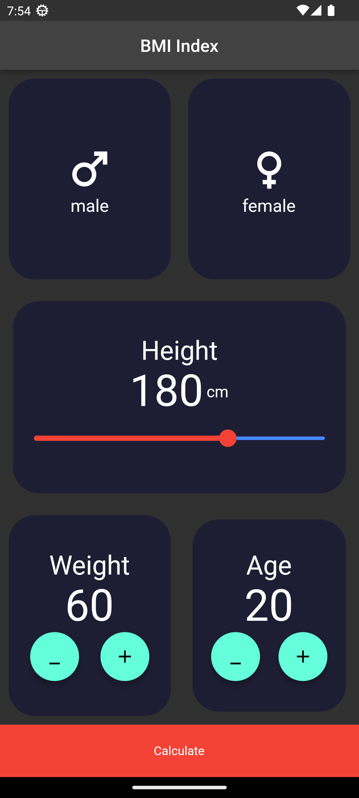
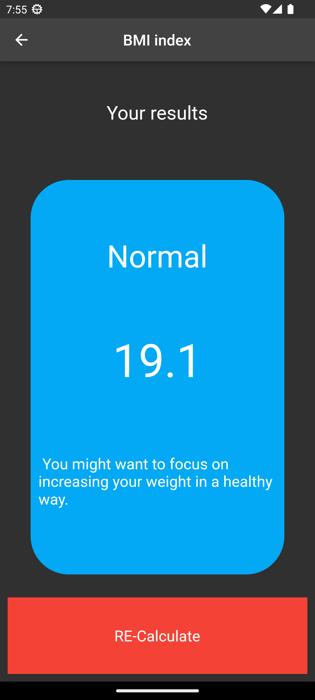
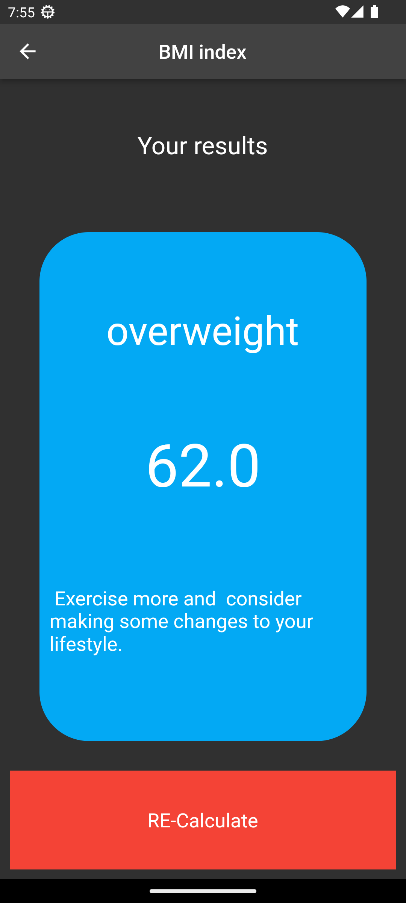

# BMIndex - Your Friendly BMI Calculator App

BMIndex is a user-friendly and interactive application designed to help you calculate your Body Mass Index (BMI) effortlessly. By providing your height, weight, and age, the app quickly calculates your BMI and provides personalized recommendations for a healthier lifestyle.

## Features

- Calculate BMI: Input your height, weight, and age to calculate your BMI with precision.
- Personalized Recommendations: Receive tailored suggestions based on your BMI, helping you make healthier choices.
- Interactive Interface: User-friendly design for a seamless experience.
- Quick and Accurate: Get your BMI calculated in seconds.
- Track Progress: Monitor your BMI over time to track your fitness journey.

## Contributions

Contributions are welcome! If you find a bug, have a suggestion, or want to add new features, please open an issue or submit a pull request.

## Contact

Have questions or feedback? Feel free to reach out to us at manojbhatta500@gmail.com

Stay healthy and take charge of your fitness journey with BMIndex!

## Screenshots

## Screenshots and Usage

### Home Screen

Welcome to BMIndex! The home screen provides a simple interface where you can start calculating your BMI.

### Input Screen

Enter your height, weight, and age in the input screen. The app requires this information to calculate your BMI accurately.

### Results Screen

After providing your information, the app calculates your BMI and displays it along with personalized recommendations for maintaining a healthy lifestyle.

